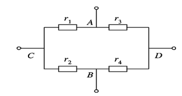
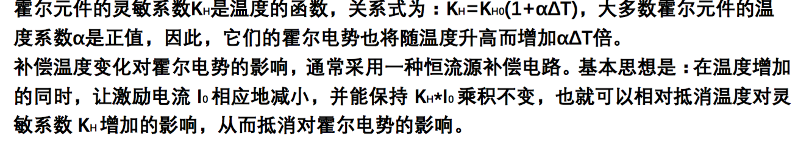

## Chapter 3
### 3-1.什么是应变效应?什么是压阻效应?利用应变效应和压阻效应解释金属电阻应变片和 半导体应变片的工作原理。
1、所谓应变效应是指金属导体在外界作用下产生机械变形（拉伸或压缩）时，其电阻值相应发生变化，这种现象称为电阻应变效应。     

2、半导体材料的电阻率ρ随作用应力的变化而发生变化的现象称为压阻效应。     


3、应变式传感器的基本工作原理：当被测物理量作用在弹性元件上，弹性元件在力、力矩或压力等作用下发生形变，变换成相应的应变或位移，然后传递给与之相连的应变片，将引起应变敏感元件的阻值发生变化，通过转换电路变成电量输出。输出的电量大小反映了被测物理量得大小。


### 3-2 试述温度误差的概念、产生的原因和补偿的办法。
1、由于测量现场环境温度的改变而给测量带来的附加误差， 称为应变片的温度误差。

 
2、产生的原因有两个：一是敏感栅的电阻丝阻值随温度变化带来的附加误差；二是当试件与电阻丝材料的线膨胀系数不同时，由于环境温度的变化，电阻丝会产生附加变形，从而产生附加电阻变化。

3、电阻应变片的温度补偿方法通常有：线路补偿和应变片自补偿 。

### 3 试用应变式传感器实现一种应用
通过应变式传感器与光线传感器配合，在家中如果晚上有人回来，刚进门时，将打开客厅的灯。洗脸池里面的底部装一个应变式传感器，当压力超过一定值得时候，关闭水龙头，防止水溢出。

## Chapter 4

### 4-1说明差动变间隙式电感传感器的主要组成、工作原理和基本特性。

差动变隙式电感传感器是利用线圈自感量的变化来实现测量的,它由线圈、铁芯和衔铁三部分组成。铁芯和衔铁由导磁材料如硅钢片或坡莫合金制成,在铁芯和衔铁之间有气隙, 传感器的运动部分与衔铁相连。当被测量变化时,使衔铁产生位移,引起磁路中磁阻变化, 从而导致电感线圈的电感量变化,因此只要能测出这种电感量的变化,就能确定衔铁位移量的大小和方向。

差动变隙式电感传感器基本特征: 

1. 灵敏度是单边式的两倍。 
2. 线性度得到明显改善。



### 4-3什么叫差动变压器？差动变压器式传感器有哪几种结构形式？各有什么特点？
1、把被测的非电量转化为线圈互感变化的传感器称为互感式传感器，这种传感器是根据变压器的基本原理制成的，并且次级绕组用差动形式连接，故称差动变压器式传感器。

2、差动变压器结构形式有：有变隙式、变面积式和螺线管式等，在非电量测量中，应用最多的是螺线管式差动变压器。

3、特点：

1. 变气隙式：灵敏度较高，但随气隙的增大而减小，非线性误差大，为了减小非线性误差，量程必须限制在较小的范围内工作，一般为气隙的1/5一下，用于测量几μｍ～几百μｍ的位移。这种传感器制作困难；
2. 变面积式：灵敏度小于变气隙式，但为常数，所以线性好、量程大，使用较广泛；
3. 螺线管式：灵敏度低，但量程大它可以测量1～100mm 机械位移，并具有测量精度高、结构简单、性能可靠、便于制作等优点，使用广泛。


### 4-11.电涡流的形成范围包括哪些内容?他们的主要特点是什么?


线圈-导体系统产生的电涡流密度既是线圈与导体间距离 x 的函数,又是沿线圈半径方 向 r 的参数。当 x 一定时,电涡流密度 J 与半径 r 的关系如下:

1. 电涡流径向形成范围大约在传感器线圈外半径的 1.8~2.5 倍范围内,且分布不均匀。
2. 电涡流密度在 r=0 处为零。
3. 电涡流密度最大值在 r=传感器线圈外半径附近的一个狭窄区域内。

### 5.用电感式传感器设计应用
电涡流探伤


在非破坏性探测领域内,电涡流传感器已被用作有效的探伤技术。例如,用来测试金属 材料的表面裂纹、热处理裂痕,砂眼、旗袍以及焊接部分的探伤等。探伤时,传感器与被测物体间距要保持不变,当有裂纹出现时,传感器阻抗发生变化,导致测量电路的输出电压改变,达到探伤的目的。电涡流传感器还可以探测地下或墙里埋没的管道或金属体,包括带金属零件的地雷。

## Chapter 5
### 5-1 根据工作原理可以将电容式传感器分为哪几类？每种类型各有什么特点？各适用于什么场合？

#### 1、电容式传感器分为：
1. 变极距(变间隙)(δ)型
2. 变面积型(S)型
3. 变介电常数(εr)型三种基本类型。
#### 2、特点与应用
1. 变极距(变间隙)(δ)型：

	只有在Δd/d0很小时，才有C与Δd 近似的线性关系，所以，这种类型的传感器一般用来测量微小变化量。

2. 变面积型(S)型：

	传感器的电容量C与线位移及角位移呈线性关系。测量范围大，可测较大的线位移及角位移。

3. 变介电常数(εr)型：

	传感器电容量C与被测介质的移动量成线性关系。常用来检测容器中的液位，或片状结构材料的厚度等。

	

### 5-9 简述差动式电容测厚传感器系统的工作原理。
在被测带材的上下两侧各置一块面积相等，与带材距离相等的极板，这样极板和带材就构成了两个电容器C1、C2。把两块极板用导线连接起来成为一个板，而带材就是电容的另一个极，其总电容为C1+C2，如果带材厚度发生变化，将引起电容量的变化，用交流电桥将电容的变化测出来，经过放大即可由电表指示测量结果。
## Chapter 6

### 6-1 什么叫正压电效应和逆压电效应？什么叫纵向压电效应和横向压电效应？

#### 1、正压电效应和逆压电效应

某些电介质,当受力变形时内部产生极化现象,同时在两个表面产生相异电荷,外力去掉后,又恢复到不带电状态.这叫压电效应.当作用力方向改变时,电荷极性随之改变,这种现象称为“正压电效应”.相反,当在电介质极化方向施加电场,这些电介质也会产生几何变形,这种现象称为“逆压电效应”.
     
#### 2、纵压电效应和横压电效应
##### （1）纵向压电效应
通常把沿电轴x方向的力作用下产生电荷的压电效应称为“纵向压电效应”。
##### （2）横压电效应
把沿机械轴y方向的力作用下产生电荷的压电效应称为“横向压电效应”。


### 6-3 简述压电陶瓷的结构及其特性。

压电陶瓷是一类具有压电特性的电子陶瓷材料. 与典型的不包含铁电成分的压电石英晶体的主要区别是： 构成其主要成分的晶相都是具有铁电性的晶粒. 由于陶瓷是晶粒随机取向的多晶聚集体，因此其中各个铁电晶粒的自发极化矢量也是混乱取向的. 为了使陶瓷能表现出宏观的压电特性，就必须在压电陶瓷烧成并于端面被复电极之后，将其置于强直流电场下进行极化处理，以使原来混乱取向的各自发极化矢量沿电场方向择优取向. 经过极化处理后的压电陶瓷，在电场取消之后，会保留一定的宏观剩余极化强度，从而使陶瓷具有了一定的压电性质.  


对于压电陶瓷而言，在未进行极化处理时，不具有压电性；经过极化处理后，它的压电性非常明显，具有很高的压电系数，为石英晶体的几百倍。在极化前，每个单晶形成一个单个的电畴，无数个单晶电畴无规则排列，知识原始的压电陶瓷呈现各向同性而不具有压电性。要使其具有压电性，必须作极化处理，即在一定温度下对其加强直流电场，迫使“电畴”趋向外电场方向作规则排列。极化电场取出后趋向电畴基本保持不变，形成很强的剩余极化，从而呈现出压电性。    
压电陶瓷的优点是其抗酸碱，机电耦合系数高，容易制成任意形状，价格变异；压电陶瓷的缺点是其温度系数大，存在一定的迟滞、蠕变及非线性，需要高压极化处理。同时，按照压电陶瓷中成分的种类多少可分为一元系至多元系压电陶瓷，其性能相差巨大，不再赘述。    

--------------------------

压电陶瓷是人工制造的多晶体压电材料。材料内部的晶粒有许多自发极化的电畴,它有一定的极化方向,从而存在磁场。在无外电场作用时,电畴在晶体中杂乱分布,它们各自的极化效应被相互抵消,压电陶瓷内极化强度为零。因此原始的压电陶瓷呈电中性,不具有压电性质。

在陶瓷上施加外电场时,电畴的极化方向发生转动,趋向于按外电场方向的排列,从而使材料得到极化。外电场愈强,就有更多的电畴更完全的转向外电场方向。让外电场强度大到使材料的极化达到饱和的程度,即所有的电畴极化方向都整齐地与外电场方向一致时,当外电场去掉后,电畴的极化方向基本不变化,即剩余极化强度很大,这时的材料才具有压电特性。


### 利用压电式传感器设计一个应用系统
食品罐头的盖子原本都是通过鼓起来判断有没有变质的一种方法，利用压电式传感器置于盖子中，当受力接近最大承受压力时，通过电路将其产生的电压将二极管点亮，这样的提示更加明显，而且盖子能循环利用。

## 第 7 章
### 7-4 什么是霍尔效应？霍尔效应与那些因素有关？
霍尔效应是指当固体导体放置在一个磁场内，且有电流通过时，导体内的电荷载子受到洛伦兹力而偏向一边，继而产生电压（霍尔电压）的现像。

根据公式 V=BI/(nqd) 可以得到，霍尔电势与所处的感应强度，流过的电流，导体的材料，霍尔片的厚度有关。

### 7-5 影响霍尔元件输出零点的因素有哪些？怎样补偿？
#### 1、影响霍尔元件输出零点的因素

1. 霍尔电极安装位置不对称或不在同一等电位面上
2. 半导体材料不均匀造成了电阻率不均匀或是几何尺寸不均匀
3. 激励电极接触不良造成激励电流不均匀分布等 

2、不等位电势与霍尔电势具有相同的数量级，有时甚至超过霍尔电势，而实用中要消除不等位电势是极其困难的，因而必须采用补偿的方法。      

可以把霍尔元件等效为一个电桥，用电桥平衡来补偿不等位电势。

由于A、 B电极不在同一等位面上，此四个电阻阻值不相等，电桥不平衡，不等位电势不等于零。此时可根据A、 B两点电位的高低，判断应在某一桥臂上并联一定的电阻，使电桥达到平衡，从而使不等位电势为零。



### 7-6 温度变化对霍尔元件输出电势有什么影响？如何补偿？
* K_h = H_h0(1 + αΔT)，由于大多数霍尔元件温度系数为正值，输出的电势会随着温度的增加而增加。
* 通过让激励电流 I_s 相应地减小，并保持 K_h*I_s 乘积不变，就抵消了温度的影响。

## Chapter 8
### 8-1光电效应有哪几种？相对应的光电器件各有哪些？
光电效应有外光电效应、内光电效应两种。内光电效应中又分为光电导效应和光生伏特效应。

1. 基于外光电效应的光电元件有光电管、光电倍增管、光电摄像管等。
2. 基于光电导效应的光电器件有光敏电阻。 
3. 基于光生伏特效应的光电器件有光电池、光敏二极管、三极管。 
### 8-2 试述光敏电阻、光敏二极管、光敏晶体管和光电池的工作原理，在实际应用时各有什么特点？

#### 1、光敏电阻的工作原理
其工作原理是基于光电导效应，其阻值随光照增强而减小。光敏电阻没有极性，纯粹是一个电阻器件，使用时既可加直流电压，也可以加交流电压。   
无光照时，光敏电阻值（暗电阻）很大，电路中电流（暗电流）很小。当光敏电阻受到一定波长范围的光照时，它的阻值（亮电阻）急剧减小，电路中电流迅速增大。一般希望暗电阻越大越好，亮电阻越小越好， 此时光敏电阻的灵敏度高。实际光敏电阻的暗电阻值一般在兆欧量级， 亮电阻值在几千欧以下。    
#### 2、光敏二极管的工作原理
在无光照时，处于反偏的光敏二极管工作在截止状态，其反向电阻很大，反向电流很小，这种反向电流称为暗电流。     
当有光照射到光敏二极管的PN结时，PN结附近受光子轰击，吸收其能量而产生电子-空穴对，它们在反向电压和内电场的作用下，漂移越过PN结，形成比无光照时大得多的反向电流，该反向电流称为光电流，此时，光敏二极管的反向电阻下降。 若入射光的强度增强，产生的电子-空穴对数量也随之增加，光电流也响应增大，即光电流与光照度成正比。       
如果外电路接上负载，便可获得随光照强弱变化的信号。光敏二极管的光电流 I 与照度之间呈线性关系。光敏二极管的光照特性是线性的，所以适合检测等方面的应用。  
#### 3、光敏晶体管的工作原理
大多数光敏晶体管的基极无引出线，当集电极加上相对于发射极为正的电压而不接基极时，集电结就是反向偏压。      
当光照射在集电结时，就会在结附近产生电子—空穴对，光生电子被拉到集电极，基区留下空穴，使基极与发射极间的电压升高，这样便会有大量的电子流向集电极，形成输出电流，且集电极电流为光电流的β倍，所以光敏晶体管有放大作用。     
#### 4、光电池的工作原理
硅光电池是在一块N型硅片上用扩散的办法掺入一些P型杂质(如硼)形成PN结。当光照到PN结区时，如果光子能量足够大，将在结区附近激发出电子-空穴对，在N区聚积负电荷，P区聚积正电荷，这样N区和P区之间出现电位差。   
 若将PN结两端用导线连起来，电路中有电流流过，电流的方向由P区流经外电路至N区。若将外电路断开，就可测出光生电动势。   

 

  

### 8-6 光在光钎中是怎么样传输的？对光钎及入射光的入射角有什么要求？


1、光在光纤内的全内反射进行传输的，实际工作时需要光纤弯曲，但只要满足全反射条件，光线仍然继续前进。可见这里的光线“转弯”实际上是由光的全反射所形成的。    
2、为满足光在光纤内的全内反射， 光入射到光纤端面的入射角θi应满足 



一般光纤所处环境为空气，则n0=1，这样上式可表示为 


--------------------

光在同一种介质中是直线传播的，当光线以不同的角度入射到光纤端面时，在端面发生折射进入光纤后，又入射到折射率较大的光密介质（纤芯）与折射率较小的光疏介质（包层）的交界面，光线在该处有一部分投射到光疏介质，一部分反射回光密介质。
对光纤的要求是包层和纤芯的折射率不同，且纤芯的折射率大于包层的折射率。对入射角的要求是入射角小于临界角。   
图见书 P140 图8-40

## Chapter 9
### 1） 简述气敏传元件的工作原理。
半导体气敏传感器的敏感部分是金属氧化物半导体微结晶粒子烧结体，当它的表面吸附被测气体时，半导体微结晶粒子接触表面的导电电子比例就会发生变化，从而使气敏元件的电阻值随被测气体的浓度而改变。这种反应是可逆的，因而是可重复使用的。   
当氧化型气体吸附到N型半导体上，还原型气体吸附到P型半导体上时，将使半导体载流子减少，而使半导体电阻值增大。    
当还原型气体吸附到N型半导体上，氧化型气体吸附到P型半导体上时，则半导体载流子增多，使半导体电阻值下降。

### 2） 为什么多数气敏元件都附有加热器？
加热器的作用是将附着在敏感元件表面上的尘埃，油雾等烧掉，加速气体的吸附，从而提高器件的灵敏度和响应速度。

### 3）什么叫湿敏电阻？湿敏电阻有哪些类型？各有什么特点?
湿敏电阻是利用湿敏材料吸收空气中的水分而导致本身电阻值发生变化的电阻。  
氯化锂湿敏电阻,半导体陶瓷湿敏电阻   
     前者优点滞后小，不受测试环境风速影响，检测精度高达±5％，但耐热性差，不能用于露点以下测量，器件性能重复性不理想，使用寿命短。   
     后者可分为负特性湿敏半导体陶瓷和正特性湿敏半导体陶瓷。前者电阻率随湿度的增加而下降，后者的表面电阻随湿度的增加而加大
## Chapter 10
### 1）超声波在介质中传播具有哪些特性？
超声波的传播速度与介密度和弹性特性有关。超声波在气体和液体中传播时，由于不存在剪切应力，所以仅有纵波的传播。

### 2）图10-3中，超声波探头的吸收块作用是什么？
吸收块的作用是降低晶片的机械品质，吸收声能量。如果没有吸收块，当激励的电脉冲信号停止时，晶片将会继续振荡，加长超声波的脉冲宽度，使分辨率变差。

### 3）超声波物位测量有几种方式?各有什么特点？


如图（a）所示，超声波发射和接收探头可设置在液体介质中，让超声波在液体介质中传播。由于超声波在液体中衰减比较小，所以即使发射的超声波脉冲幅度较小也可以传播。


如图（b），超声波发射和接收探头安装在液面的上方，让超声波在空气中传播，这种方式便于安装和维修，但超声波在空气中的衰减比较厉害。

### 5) 已知超声波探头垂直安装在被测介质底部，超声波在被猜测介质中的传播速度为1460m/s，测得时间间隔为28us，试求物位高度？
解：h=ct/2=20.44mm

## Chapter 11
### 1） 简述微波传感器的测量机理。 
由发射天线发出微波，此波遇到被测物体时将被吸收或反射，使微波功率发生变化。若利用接收天线，接收到通过被测物体或由被测物体反射回来的微波，并将它转换为电信号，再经过信号调理电路，即可以显示出被测量，实现了微波检测。


### 2） 微波传感器有哪些特点？微波传感器如何分类？ 
特点：    

1. 有极宽的频谱（波长=1.0mm～1.0m）可供选用，可根据被测对象的特点选择不同的测量频率；  
2. 在烟雾、粉尘、水汽、化学气氛以及高、低温环境中对检测信号的传播影响极小，因此可以在恶劣环境下工作； 
3. 介质对微波的吸收与介质的介电常数成比例，水对微波的吸收作用最强； 
4. 时间常数小，反应速度快，可以进行动态检测与实时处理，便于自动控制；  
5. 测量信号本身就是电信号，无须进行非电量的转换，从而简化了传感器与微处理器间的接口，便于实现遥测和遥控； 
6. 微波无显著辐射公害。微波传感器存在的主要问题是零点漂移和标定尚未得到很好的解决。其次，使用时外界环境因素影响较多，如温度、气压、取样位置等。

根据微波传感器的原理可以分为反射式和遮断式。
### 4） 微波无损检测是如何进行测量的
微波无损检测是综合利用微波与物质的相互作用，一方面微波在不连续的界面会产生反射，散射，透射；另一方面微波还能与被检材料产生相互作用，此时的微波场会受到材料中的电磁参数和几何参数的影响。通过测量微波信号基本参数的改变即可达到检测材料内部缺陷的目的。

## Chapter12
### 1）红外探测器类型及工作原理
1. 热探测器：热探测器吸收红外辐射后，温度升高，可以使探测材料产生温差电动势、电阻率变化，自发极化强度变化，或者气体体积与压强变化等，测量这些物理性能的变化就可以测定被吸收的红外辐射能量或功率。
	1. 液态的水银温度计及气动的高莱池（Golay cell）：利用了材料的热胀冷缩效应。 　　
	2. 热电偶和热电堆：利用了温度梯度可使不同材料间产生温差电动势的温差电效应。 　　
	3. 石英共振器非制冷红外成像列阵：利用共振频率对温度敏感的原理来实现红外探测。 　　
	4. 测辐射热计：利用材料的电阻或介电常数的热敏效应—辐射引起温升改变材料电阻—用以探测热辐射。因半导体电阻有高的温度系数而应用最多，测温辐射热计常称“热敏电阻”。另外，由于高温超导材料出现，利用转变温度附近电阻陡变的超导探测器引起重视。如果室温超导成为现实，将是21世纪最引人注目的一类探测器； 　　
	5. 热释电探测器：有些晶体，如硫酸三甘酞、铌酸锶钡等，当受到红外辐射照射温度升高时，引起自发极化强度变化，结果在垂直于自发极化方向的晶体两个外表面之间产生微小电压，由此能测量红外辐射的功率。
2. 光子探测器：光子探测器吸收光子后，本身发生电子状态的改变，从而引起内光电效应和外光电效应等光子效应，从光子效应的大小可以测定被吸收的光子数。
	1. 光电导探测器：又称光敏电阻。半导体吸收能量足够大的光子后，体内一些载流子从束缚态转变为自由态，从而使半导体电导率增大，这种现象称为光电导效应。利用光电导效应制成的光电导探测器分为多晶薄膜型和单晶型两种。 　　
	2. 光伏探测器：主要利用p-n结的光生伏特效应。能量大于禁带宽度的红外光子在结区及其附近激发电子空穴对。存在的结电场使空穴进入p区，电子进入n区，两部分出现电位差，外电路就有电压或电流信号。与光电导探测器比较，光伏探测器背景限探测率大40%，不需要外加偏置电场和负载电阻，不消耗功率，有高的阻抗。 　　
	3. 光发射-Schottky势垒探测器：金属和半导体接触，形成Schottky势垒，红外光子透过Si层被PtSi吸收，使电子获得能量跃迁至费米能级，留下空穴越过势垒进入Si衬底，PtSi层的电子被收集，完成红外探测。
	4. 量子阱探测器（QWIP）：将两种半导体材料用人工方法薄层交替生长形成超晶格，在其界面有能带突变，使得电子和空穴被限制在低势能阱内，从而能量量子化形成量子阱。利用量子阱中能级电子跃迁原理可以做红外探测器。因入射辐射中只有垂直于超晶格生长面的电极化矢量起作用，光子利用率低；量子阱中基态电子浓度受掺杂限制，量子效率不高；响应光谱区窄；低温要求苛刻。  

	

-----------


红外探测器是利用红外辐射与物质相互作用所呈现的物理效应来探测红外辐射的。红外探测器的种类很多，按探测机理的物理效应可分为两大类：
（1）一类是器件的某些性能参数随入射的辐射通量作用引起的温度变化的热探测器；
（2）另一类是利用各种光子效应的光子探测器，即入射到探测器上的红外辐射能以光子的形式与光电探测器材料的束缚电子相互作用，从而释放出自由电子和自由空穴参与导电的器件。光子探测器的响应正比于吸收的光子数。 

	
### 2）什么是放射性同位素？辐射强度与什么因素有关？
1. 如果两个原子质子数目相同，但中子数目不同，则他们仍有相同的原子序，在周期表是同一位置的元素，所以两者就叫同位素。有放射性的同位素称为“放射性同位素”,没有放射性并且半衰期大于1050年的则称为“稳定同位素”。
2. 放射性同位素放射出的射线碰到各种物质的时候，会产生各种效应，它包括射线对物质的作用和物质对射线的作用两个相互联系的方面。例如，射线能够使照相底片和核子乳胶感光；使一些物质产生荧光；可穿透一定厚度的物质，在穿透物质的过程 中，能被物质吸收一部分，或者是散射一部分，还可能使一些物质的分子发生电离； 另外，当射线辐照到人、动物和植物体时，会使生物体发生生理变化。射线与物质的相互作用，对核射线来说，它是一种能量传递和能量损耗过程，对受照射物质来说，它是一种对外来能量的物理性反应和吸收过程。   


各种射线由于其本身的性质不同，与物质的相互作用各有特点。这种特点还常与物质的密度和原子序数有关。α射线通过物质时，主要是通过电离和激发把它的辐射能量转移给物质，其射程很短，一个1兆电子伏（1MeV）的α射线，在空气中的射程 约1.0<厘米，在铅金属中只有23微米（μm），运动 方向会发生改变，产生轫致辐射。轫致辐射是一种连续的电磁辐射，它发生的几率与β射线的能量和物质的原子序数成正比，因此在防护上采用低密度材料，以减少轫致辐射。β射线能被不太厚的铝层等吸收。γ射线的穿透力最强，射程最大，1MeV的r射线 在空气中的射程约有米之远，r射线作用于物质可产生光电效应、康普顿效应和电子对效应，它不会被物质完全吸收，只会随着物质厚度的增加而逐渐减弱。


## Chapter 13
### 13-1 数字式传感器有什么特点？可以分为哪几种类型？

#### 特点
数字式传感器(Digital Sensor)能够直接将非电量转换为数字量，这样就不需要A／D转换，直接用数字显示。数字式传感器与模拟式传感器相比有以下优点：测量精度和分辨率高，稳定性好，抗干扰能力强，便于与微机接口，适宜远距离传输等。

#### 类型
1. 码盘式传感器
2. 光栅式传感器
3. 磁栅式传感器
4. 感应同步式传感
5. 频率输出式传感器

### 13-2 光栅传感器的组成工作原理
#### 组成：

光源，透镜，光栅副和光电接收元件等
 
当光纤光栅所处环境的温度、应力、应变或其它物理量发生变化时，光栅的周期或纤芯折射率将发生变化，从而使反射光的波长发生变化，通过测量物理量变化前后反射光波长的变化，就可以获得待测物理量的变化情况。


如利用磁场诱导的左右旋极化波的折射率变化不同，可实现对磁场的直接测量。此外，通过特定的技术，还可实现对应力和温度的分别测量和同时测量。通过在光栅上涂敷特定的功能材料（如压电材料），对电场等物理量的间接测量也能实现。

### 13-5 码盘式转角-数字传感器的工作原理是什么？其基本组成部分有哪些


#### 基本组成部分：

1. 安装在旋转轴上的码盘
2. 窄缝
3. 圆盘两边的光源和光敏元件

#### 工作原理：

码盘由光学玻璃刻上同心码道制成，每位码道上都有按一定规律排列的亮区和暗区。它是一个n位二进制码盘。当光源投射在转动的码盘上时，有亮区的光线经窄缝后，被光敏元件接收。光敏元件的排列与码道一一对应，对应于亮区和暗区的光敏元件输出的信号，为”1“和”0“。当码盘旋至不同位置时，光敏元件输出信号按一定规律编码的数字量代表码盘轴的角位移大小。



## Chapter14
### 14-1	什么是智能传感器?它包含哪几种主要形式?应从哪些方面研究开发智能传感器?
所谓智能式传感器，就是一种带有微处理器的，兼有信息检测、信号处理、信息记忆、逻辑思维与判断功能的传感器。即“电五官”+“电脑”。   
#### 智能传感器主要形式   
（1） 一是采用微处理机或微型计算机系统以强化和提高传统传感器的功能， 即传感器与微处理机可分为两个独立部分，传感器的输出信号经处理和转化后由接口送到微处理机部分进行运算处理。这就是我们指的一般意义上的智能传感器, 又称传感器的智能化。   
（2）二是借助于半导体技术把传感器部分与信号预处理电路、输入输出接口、 微处理器等制作在同一块芯片上，即成为大规模集成电路智能传感器，简称集成智能传感器。   


#### 研究开发智能传感器
一是采用先进的微电子技术、计算机技术，研究开发出将传感器和微处理器结合、具有各种功能的单片集成化智能传感器，这是当前智能传感器的主要发展方向之一；   


二是针对传感器的材料，利用生物工艺和纳米技术，开发分子和原子生物传感器，这将为以后智能传感器的发展奠定基础；  


三是整合国内外芯片技术，结合敏感电子元件，研发出混合型集成智能传感器，这种传感器精度更高、成本更低、稳定性更好。我国在集成智能传感器领域已经取得了重大突破，国产传感器逐步打开了智能传感器的市场份额。  


### 14-2	智能传感器一般由哪些部分构成？它有哪些显著特点？
智能传感器系统一般由被测量、传感器、预处理及接口、微型机、输出接口以及执行机构等组成。

智能传感器具有逻辑判断、统计处理、自诊断、自校准、自适应、自调整、组态、记忆、存储等功能特点。

1. 利用微处理器不仅能提高传感器的线性度,而且能够对各种特性进行补偿。 2. 提高了测量可靠性,测量数据可以存取,使用方便。
3. 测量精度高。
4. 灵敏度高,可进行微小信号的测量。
5. 具有数字通信接口,能与微型计算机直接连接,相互交换信息。 6. 多功能。
7. 超小型化,微型化,微功耗。


### 14-3 传感器的智能化与集成智能传感器有何区别？
传感器都是为了感应而反馈信号给主机，只有用途和功能不同，没有本质不同。  


集成传感器系统小型化，消除了传统结构的某些不可靠因素，改善整个系统的抗干扰件能;同时它还有诊断、校淮和数据存储功能(对于智能结构系统还有自适应功能)，具有良好的稳定性。

----------


传感器的智能化指的是传感器与微处理机可以分为两个独立部分，传感器的输出信号经处理和转化后经由接口送入微处理机部分进行运算处理。这类智能传感器主要由传感器，微处理器及其相关电路组成。


而集成智能传感器指的是利用集成电路工艺和微机械技术将传感器敏感元件与功能强大的电子电路集成在同一芯片上，通常具有信号提取、信号处理、逻辑判断、双向通信、量程切换、自校准等功能。








## 1.	什么是MEMS传感器？
MEMS(Micro Electric Mechanical System)：即微电子机械系统。用微电子技术和微机械技术制造的微敏感器件与微执行器的总和。是在微电子技术基础上发展起来的多学科交叉的前沿研究领域。   

MEMS传感器是采用微电子和微机械加工技术制造出来的新型传感器。它的操作范围在微米范围内


 MEMS（微机电系统）是指集微型传感器、执行器以及信号处理和控制电路、接口电路、通信和电源于一体的微型机电系统。 


## 2.	MEMS传感器由几部分组成？各部分的作用是什么？
集微型传感器、执行器以及信号处理和控制电路、接口电路、通信和电源于一体（7）

作用：可以进一步可以将机械可动部、电子线路、传感器等集成到一片硅板上；它的尺寸很小，热膨胀等的影响小高速动作可能且比较安全。


